# Waggle LoRaWAN Usage Instructions

The [Waggle Edge Stack (WES)](https://github.com/waggle-sensor/waggle-edge-stack) has support for LoRaWAN devices using the [chirpstack.io](https://www.chirpstack.io/docs/index.html) stack.

**Table of Contents**
- [Waggle LoRaWAN Usage Instructions](#waggle-lorawan-usage-instructions)
  - [Enabling WES access to the RAK concentrator](#enabling-wes-access-to-the-rak-concentrator)
  - [Configuring the WES LoraWAN](#configuring-the-wes-lorawan)
    - [1. Identify the `wes-chirpstack-server` service address](#1-identify-the-wes-chirpstack-server-service-address)
    - [2. `ssh` proxy connect to the Waggle node](#2-ssh-proxy-connect-to-the-waggle-node)
    - [3. Open the Chirpstack Web UI in a browser](#3-open-the-chirpstack-web-ui-in-a-browser)
    - [4. Connect to the `wes-gateway`](#4-connect-to-the-wes-gateway)
    - [5. Add the Application](#5-add-the-application)
    - [6. Creating Device Profiles from the built-in templates](#6-creating-device-profiles-from-the-built-in-templates)
    - [7. Add Devices to the `wes-application`](#7-add-devices-to-the-wes-application)
      - [_OTAA Device Activation_](#otaa-device-activation)
      - [_ABP Device Activation_](#abp-device-activation)
    - [8. Access LoRaWAN Data using test `python` app](#8-access-lorawan-data-using-test-python-app)
  - [Adding Custom Device Profiles](#adding-custom-device-profiles)
    - [Add the 'ABP' device profile](#add-the-abp-device-profile)
    - [Add the 'OTAA' device profile](#add-the-otaa-device-profile)


## Enabling WES access to the RAK concentrator

In order for the RAK concentrator (Model: RAK7248, Module: [RAK2287](https://store.rakwireless.com/products/rak2287-lpwan-gateway-concentrator-module?variant=41826859385030)) to be accessed by the WES Chirpstack the [Waggle Node's](https://docs.waggle-edge.ai/docs/about/architecture#waggle-nodes) RPi needs to be properly `labeled` within Kubernetes.

> Note: this will automatically be done in a later update to https://github.com/waggle-sensor/wes-device-labeler but must be done manually for now.

To manually apply the `label` perform the following steps:

> **The below steps are temporary because of how the https://github.com/waggle-sensor/wes-device-labeler works.  The device-labeler removes any labels that aren't in the cloud manifest and also verified via a hardware availability test.** So the below steps can be used to get the gateway-bridge to run, but after a short time the gateway-bridge will be terminated by K3S due to the missing node label.

- login to the node
  ```bash
  $ ssh waggle-dev-node-W030
  ```

- identify the ID of the RPi
  ```bash
  $ sudo kubectl get node
  NAME                          STATUS   ROLES                  AGE    VERSION
  0000e45f012e8689.ws-rpi       Ready    <none>                 47d    v1.20.2+k3s1
  000048b02d0766cd.ws-nxagent   Ready    <none>                 49d    v1.20.2+k3s1
  000048b02d0766be.ws-nxcore    Ready    control-plane,master   196d   v1.20.2+k3s1
  ```

- apply the `resource.lorawan` label to the RPi
  ```bash
  $ sudo kubectl label node 0000e45f012e8689.ws-rpi resource.lorawan=true
  node/0000e45f012e8689.ws-rpi labeled
  ```

- verify the `wes-chirpstack-gateway-bridge` pod is running
  ```bash
  $ sudo kubectl get pod | grep wes-chirpstack-gateway-bridge
  wes-chirpstack-gateway-bridge-fbbdd4f4c-ksqjr    2/2     Running        0          5m27s
  ```

> Note: to remove the label you can execute the following example command: `sudo kubectl label node 0000e45f012e8689.ws-rpi resource.lorawan-`

## Configuring the WES LoraWAN

Access to the LoRaWAN device(s) data is configured using the [chirpstack.io](https://www.chirpstack.io/docs/index.html) software stack that is part of the default [Waggle Edge Stack (WES)](https://github.com/waggle-sensor/waggle-edge-stack) deployment (see [wes-chirpstack](https://github.com/waggle-sensor/waggle-edge-stack/tree/main/kubernetes/wes-chirpstack)). The configuration is done by accessing the [chirpstack.io application server](https://www.chirpstack.io/docs/chirpstack/configuration.html) Web UI on the target [Waggle Node](https://docs.waggle-edge.ai/docs/about/architecture#waggle-nodes).

The following documentation sources may be helpful in configuring the Chirpstack software stack and connecting LoRaWAN devices:
- Chirpstack Documentation: https://www.chirpstack.io/docs/index.html
- Initial investigation: https://github.com/waggle-sensor/summer2022/blob/main/Tsai/Documentation.md

### 1. Identify the `wes-chirpstack-server` service address

First, connect to the desired node (ex. `W030`) and identify the IP address of the `wes-chirpstack-server`

```bash
$ ssh waggle-dev-node-W030 "sudo kubectl get svc | grep wes-chirpstack-server | xargs | cut -d' ' -f3"
Welcome to our node SSH gateway, Joe Swantek!

We are connecting you to node W030 (000048B02D0766BE)...
10.43.12.212
```

### 2. `ssh` proxy connect to the Waggle node

Use the above identified IP address (ex. `10.43.12.212`) establish a proxy connection to the `wes-chirpstack-server` web UI

```bash
ssh -L 8080:10.43.12.212:8080 waggle-dev-node-w030
```

### 3. Open the Chirpstack Web UI in a browser

Enter the `wes-chirpstack-server` Web UI address http://localhost:8080/ into a browser

You will be presented with a login UI

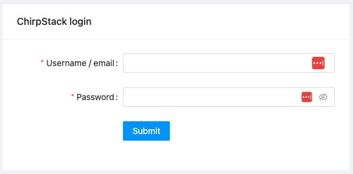

Login with the `admin` / `admin` credentials. You will be presented with an empty Chirpstack dashboard

### 4. Connect to the `wes-gateway`

Reference:
- Chirpstack gateway docs: https://www.chirpstack.io/docs/chirpstack/use/gateways.html

Click on 'Gateways' under the 'Tenant' section on the left. Select the 'Add Gateway' button (on the upper right). Enter the following:
- `wes-gateway` for the 'Name'
- `D2CE19FFFEC9D449` for the 'Gateway ID (EUI64)'

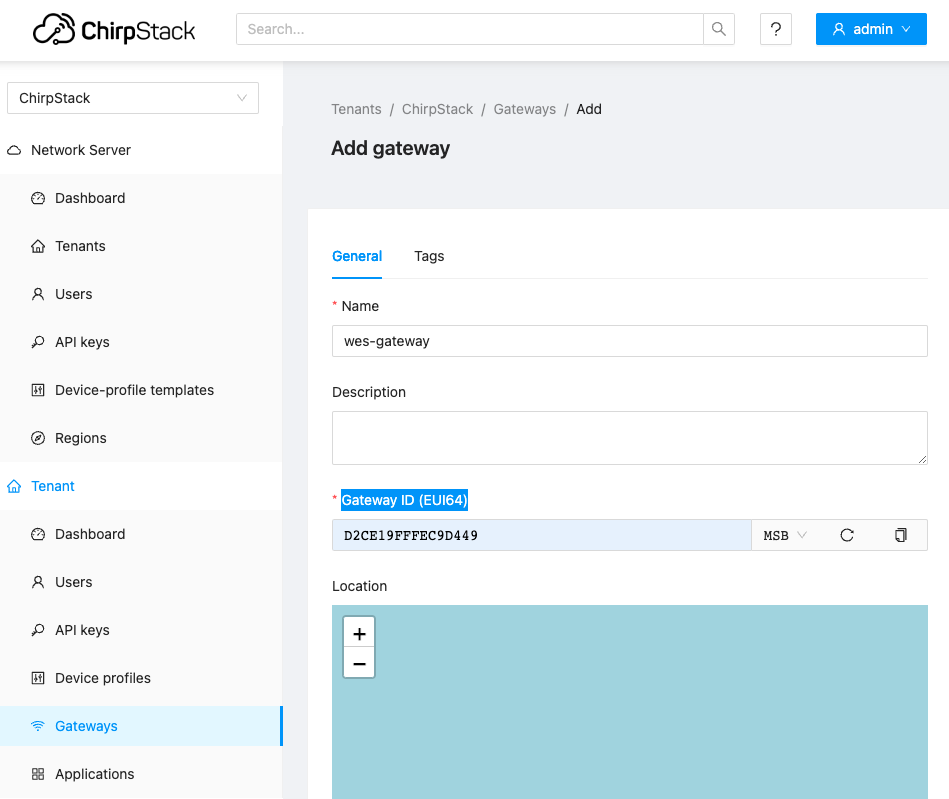

Scroll to the bottom and click the 'Submit' button. 

Clicking on 'Gateways' under the 'Tenant' section on the left should show the newly added gateway with a recent 'Last seen' time.


> Note: it may take a few moments for the 'Last seen' to be populated and a URL re-fresh may be necessary. If the 'Last seen' is not populated then there is an issue that needs to be debugged.

Clicking on the 'Gateway ID' will take you to the gateway details page where you can view the most recent LoRaWAN data via the 'LoRaWAN frames' tab.

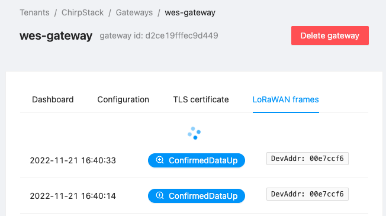

From here you can click on any frames 'ConfirmedDataUp' link to see the details of the frame.

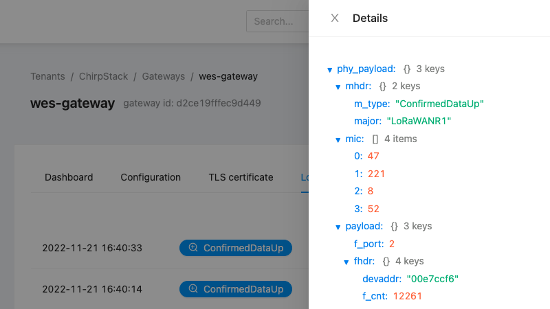

### 5. Add the Application

LoRaWAN devices are associated with a Chirpstack "application" and therefore an "application" needs to be created.

Reference:
- Chirpstack application docs: https://www.chirpstack.io/docs/chirpstack/use/applications.html

Click on 'Applications' under the 'Tenant' section on the left. Select the 'Add application' button (on the upper right). Enter the following:
- `wes-application` for the 'Name'

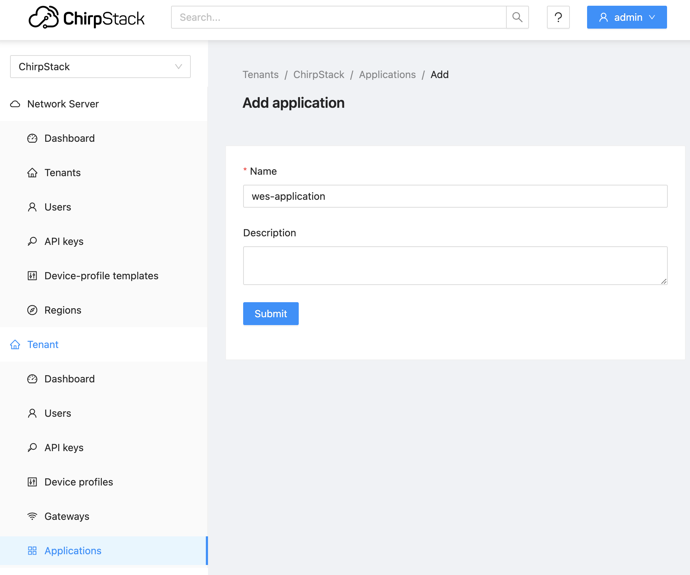

Click the 'Submit' button.

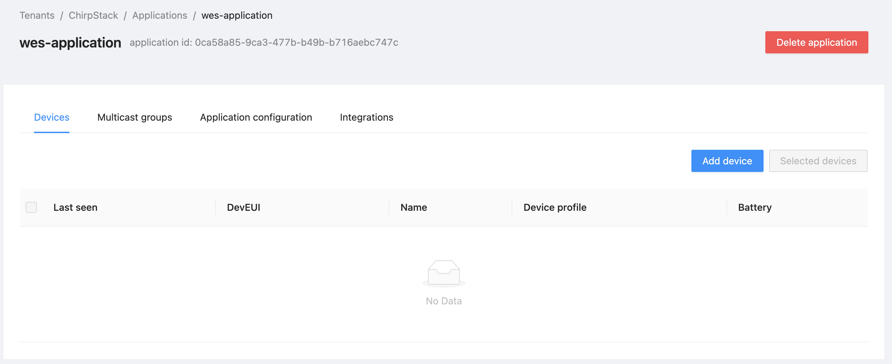

### 6. Creating Device Profiles from the built-in templates

The Chirpstack server comes pre-loaded with hundreds of "Device-profile templates" from [The Things Network LoRaWAN devices github repository](https://github.com/TheThingsNetwork/lorawan-devices). In this step we will create "Device profiles" from these templates in order to properly configure the devices for connection to an "application" (below).

Devices are associated and authenticated to a Chirpstack "application".  There are two methods of authentication:
1. Over the Air Activation (OTAA)
2. Activation by Personalization (ABP)

|                 |                                                           ABP                                                            |                                                                OTAA                                                                |
| :-------------: | :----------------------------------------------------------------------------------------------------------------------: | :--------------------------------------------------------------------------------------------------------------------------------: |
| **Description** | Uses Device Address (DevAddr), Network Session Key (NWK SKEY), and Application Session Key (APP SKEY) to join the server | Uses Application Key (APP KEY) for request joining the server. Once joined, The NWK SKEY, APP SKEY, and DevAddr will be generated. |
|    **Pros**     |                                          Can rejoin network after device reset                                           |                         The session keys don't have to be hardcoded; only the application key has to match                         |
|    **Cons**     |                             The DevAddr, NWKSKEY, APPSKEY have to be hardcoded in the device                             |                       To rejoin network after device reset, you have to manually match up the device address                       |

Reference:
- Chirpstack device-profile templates docs: https://www.chirpstack.io/docs/chirpstack/use/device-profile-templates.html
- Device activation technologies (ex. OTAA): https://www.chirpstack.io/docs/chirpstack/features/device-activation.html

The following instructions demonstrate adding two example device profiles:
- [MKR WAN 1310](https://store.arduino.cc/products/arduino-mkr-wan-1310)
- [LoRa E5-mini](https://www.seeedstudio.com/LoRa-E5-mini-STM32WLE5JC-p-4869.html)

Before we can add the devices to the `wes-application` we need to create "Device profiles" for the devices based on the "Device-profile templates".

Click on 'Device profiles' under the 'Tenant' section on the left. Select the 'Add device profile' button (on the upper right). Select the 'Select device-profile template'. Search for the device by clicking on the drop-down box.

For example, for the "MKR WAN 1310" you would select the following:
- Arduino SA -> Adruino MKR WAN 1310 -> FW version: <version> -> US915


For example, for the "LoRa E5-mini" you would select the following:
- Seeed Technology Co., Ltd -> Wio-E5 Dev Kit, for Long Range Application -> FW version: <version> -> US915


> Note: if you don't know the specifics of your device you can search for template definition within [The Things Network LoRaWAN devices github repository](https://github.com/TheThingsNetwork/lorawan-devices).

> Note: if you don't want to use a built in template, you can create custom "Device profiles" via the instructions below.

After selecting "OK", the "Device profile" will be loaded with all the template defaults.

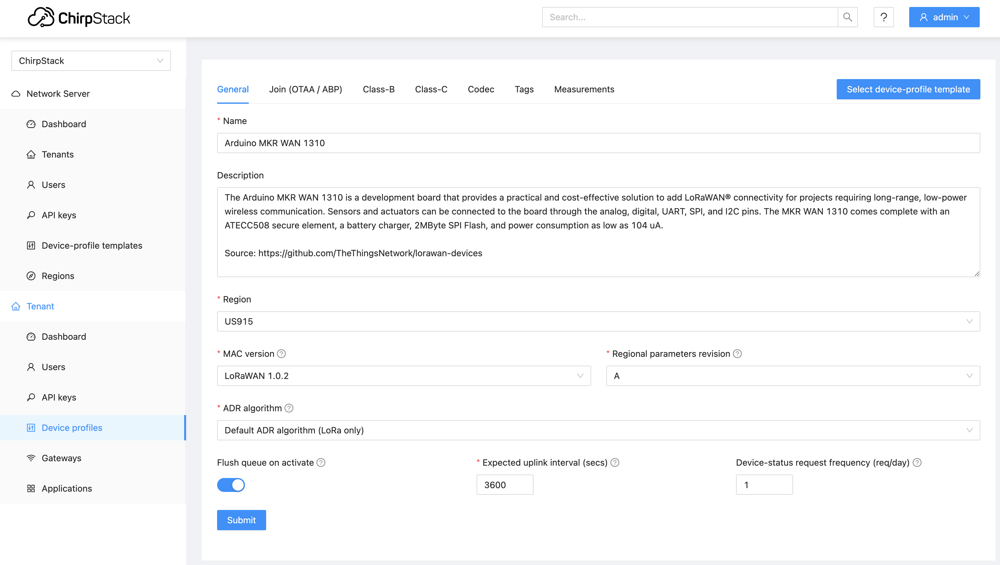

Click the "Submit" button after making any modifications.

After adding the "Device profiles" you will see a summary of all the created "Device profiles".


### 7. Add Devices to the `wes-application`

With the "Device profiles" created for the devices, the devices can now be added to the `wes-application`. 

Reference:
- Chirpstack devices docs: https://www.chirpstack.io/docs/chirpstack/use/devices.html
- Example MKRWAN setup: https://github.com/waggle-sensor/summer2022/blob/main/Tsai/Documentation.md#setting-up-the-mkrwan

From within the `wes-application` created above, click the 'Add device' button.

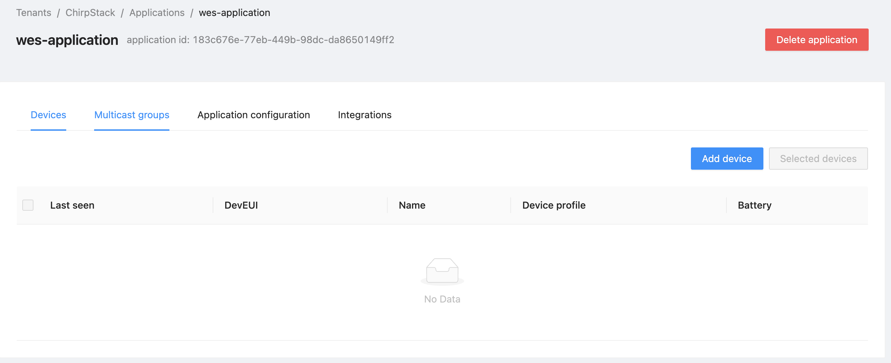

#### _OTAA Device Activation_

On the 'Add device' screen enter the following:
- a unique name (ex. `MKRWAN1310 Device 1`) for the 'Name'
- the device's EUI (ex. `123456789abcdeff`) for the 'Device EUI (EUI64)'. You may need to identify the device's EUI via a serial connection to the device.
- select the appropriate 'Device profile' (ex. `Adruino MKR WAN 1310`)

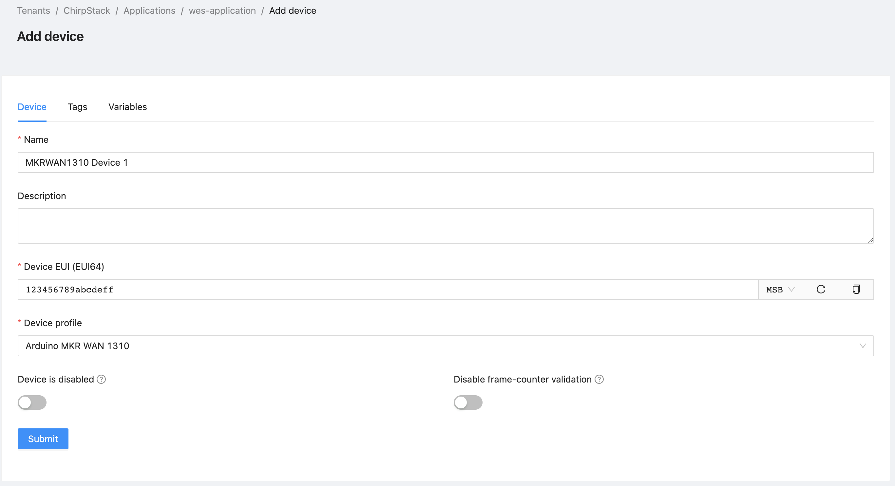

Click the "Submit" button.

Now you will be presented with a screen for the activation of the device.

For OTAA devices you will be asked for the 'Application key'.  You can randomly generate one or type in pre-defined key here.


Click the "Submit" button.

You will then be presented with a dashboard for the device where you can check the 'OTAA keys', see 'Activation' status and browse the 'LoRaWAN frames'.


> Note: at the time of writing this tutorial there we no devices available to verify these steps.

#### _ABP Device Activation_

If the device does not support OTAA activation, then ABP activation can be done.

Like the above OTAA configuration you will enter the following:
- a unique name (ex. `Test Device 1`) for the 'Name'
- the device's EUI (ex. `ffedcba987654321`) for the 'Device EUI (EUI64)'. You may need to identify the device's EUI via a serial connection to the device.
- select the appropriate 'Device profile' (ex. `testABP`)

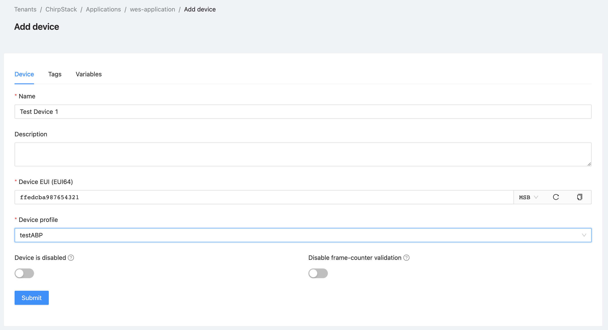

Click the 'Submit' button

You will then be presented with a dashboard for the device with the 'OTAA keys' disabled. Navigate to the 'Activation' tab to input the 'Device address', 'Network session key' and 'Application session key'.

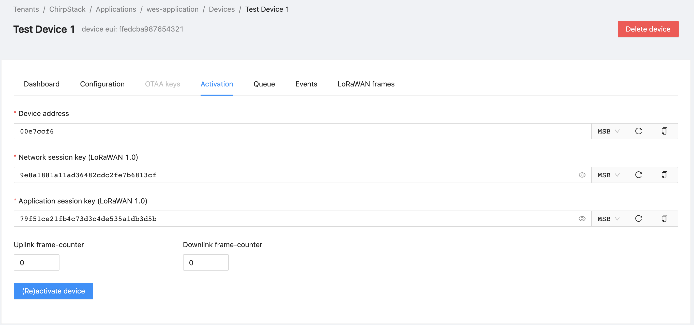

Click '(Re)activate device`

> Note: at the time of writing this tutorial there we no devices available to verify these steps.

### 8. Access LoRaWAN Data using test `python` app

The `lorawan-test.py` `python` app can be run on a [Waggle Node](https://docs.waggle-edge.ai/docs/about/architecture#waggle-nodes) to subscribe to LoRaWAN device data (within an Chirpstack application) and demonstrate how to publish this data to [Beehive](https://docs.waggle-edge.ai/docs/about/architecture#beehive).

To run the application on a node perform the following steps:
- login to a node
  ```bash
  $ ssh waggle-dev-node-W030
  ```

- `git` clone this repository
  ```bash
  $ git clone https://github.com/waggle-sensor/waggle-lorawan.git
  ```

- navigate to the folder and build and run the code (ref: https://docs.waggle-edge.ai/docs/tutorials/edge-apps/testing-an-edge-app)
  ```bash
  ~/waggle-lorawan$ sudo pluginctl build .
  ...
  Successfully built plugin

  10.31.81.1:5000/local/waggle-lorawan

  ~/waggle-lorawan$ sudo kubectl apply -f lorawan-test.yaml
  deployment.apps/waggle-lorawan created
  ```

  This will launch the [kubernetes](https://kubernetes.io/) pod using the customizations provided by the `lorawan-test.yaml`

  > Note: you may need to make changes to the `lorawan-test.yaml` file to modify items like `MQTT_SUBSCRIBE_TOPIC` that define the Chirpstack application ID to subscribe to

- see the logs from the application

  ```
  ~/waggle-lorawan$ sudo kubectl logs -f $(sudo kubectl get pod | grep -e lorawan | cut -d' ' -f1)
  2022/11/23 18:42:38 connecting [wes-rabbitmq:1883]...
  2022/11/23 18:42:38 subscribing [application/2/device/#]...
  2022/11/23 18:42:38 waiting for callback...
  ```

- tear down the test app
  ```bash
  ~/waggle-lorawan$ sudo kubectl delete -f lorawan-test.yaml
  ```

> Note: at the time of writing this tutorial the `lorawan-test.py` file is incomplete

## Adding Custom Device Profiles

If the built in device profile templates are not sufficient then default "ADP" and "OTAA" device profiles can be configured.

References
- Initial investigation using an older Web UI: https://github.com/waggle-sensor/summer2022/blob/main/Tsai/Documentation.md#setup-device-profiles

### Add the 'ABP' device profile

In order for a LoRaWAN device to connect to an "application" (see below) it will need to authenticate using a device profile.

Click on 'Device profiles' under the 'Tenant' section on the left. Select the 'Add device profile' button (on the upper right). Enter the following:
- `ABP` for the 'Name'
- `US915` for the 'Region'
- `LoRaWAN 1.0.2` for the 'MAC version'
- `B` for the 'Regional parameters revision'
- `Default ADR algorithm (LoRa only)` for 'ADR algorithm'
- `30000` for 'Expected uplink interval (secs)'

> Note: the value for 'Expected uplink interval' may change based on the deployment configuration.


Select the 'Join (OTAA / ABP)' tab and disable the 'Device supports OTAA'


Select the 'Class-B' tab and enable the 'Device supports Class-B' 


Select the 'Class-C' tab and enable the 'Device supports Class-C'


> Note: it is possible to select the 'Payload codec' to have the Application Server decode the data.

Click the 'Submit' button.


### Add the 'OTAA' device profile

Just like was done for the above 'ABP' profile we need to add an 'OTAA' device profile to enable proper device connections.

Click on 'Device profiles' under the 'Tenant' section on the left. Select the 'Add device profile' button (on the upper right). Enter the following:
- `OTAA` for the 'Name'
- `US915` for the 'Region'
- `LoRaWAN 1.0.2` for the 'MAC version'
- `B` for the 'Regional parameters revision'
- `Default ADR algorithm (LoRa only)` for 'ADR algorithm'
- `80000` for 'Expected uplink interval (secs)'

> Note: the value for 'Expected uplink interval' may change based on the deployment configuration.

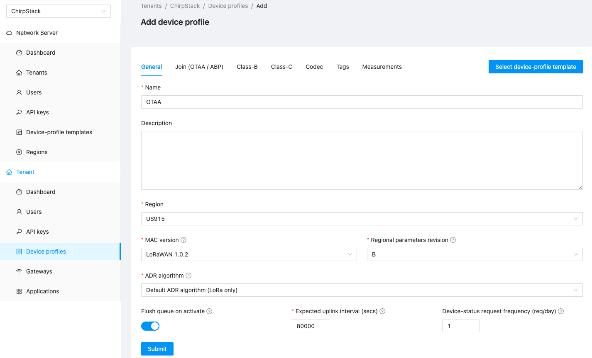

Select the 'Join (OTAA / ABP)' tab and enable the 'Device supports OTAA'


Select the 'Class-B' tab and disable the 'Device supports Class-B' 


Select the 'Class-C' tab and disable the 'Device supports Class-C'


> Note: it is possible to select the 'Payload codec' to have the Application Server decode the data.

Click the 'Submit' button.

